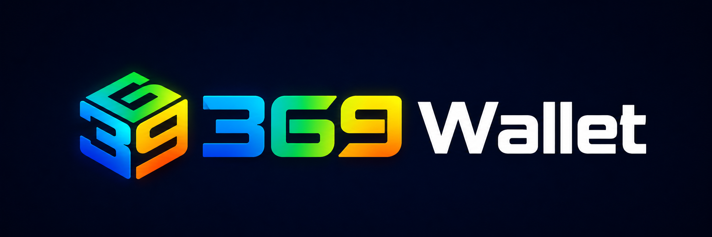

<p align="center">
  
</p>

<h1 align="center">369wallet / skills</h1>

<p align="center">
  Open-source skills for the <a href="https://www.369wallet.xyz/en/agent">369wallet Agent</a> —
  a signing layer, identity registry, and asset-management toolkit for autonomous agents on
  <b>Circle Arc</b>, <b>Upbit Giwa</b>, and <b>BNB Chain</b>.
</p>

---

## Why this exists

369wallet is a multi-chain wallet. The **Agent** layer turns it into a programmable surface for autonomous software — agents that can hold identity, sign with scoped permissions, manage assets, and pay over HTTP.

This repository is the public catalog of skills that expose those capabilities to any agent runtime (MCP clients, LLM agents, custom orchestrators).

## Supported chains

| Chain | Role |
| --- | --- |
| **Arc** (Circle) | Native USDC, HTTP 402 settlement |
| **Giwa** (Upbit) | L2 throughput |
| **BNB** | Mainstream EVM coverage |

Skills declare their supported chains in the SKILL.md frontmatter.

## Skill catalog

### Signing & Identity
- [`agent-wallet`](./agent-wallet) — Scoped, revocable session-key signing.
- [`multichain-signing`](./multichain-signing) — Unified signing across Arc · Giwa · BNB.
- [`did-identity`](./did-identity) — Portable on-chain DID with ECDSA proofs.

### Asset Management
- [`swap-skill`](./swap-skill) — Quote and execute token swaps.
- [`stake-skill`](./stake-skill) — Stake, claim, unstake.
- [`transfer-skill`](./transfer-skill) — Native and ERC-20 transfers.
- [`balance-portfolio`](./balance-portfolio) — Per-chain balances and aggregated portfolio.

### Payments
- [`x402-payment`](./x402-payment) — HTTP 402 flows settled in USDC on Arc.

### MCP Servers
- [`mcp-wallet-server`](./mcp-wallet-server) — Wallet operations over MCP.
- [`mcp-chain-server`](./mcp-chain-server) — Read-only chain operations over MCP.

### Extensions
- [`defi-adapters`](./defi-adapters) — Plug-in DeFi protocol adapters.

### Guide
- [`369wallet-guide`](./369wallet-guide) — Orientation for first-time readers and agents.

## Skill structure

Every skill folder follows the same shape:

```
<skill-name>/
├── SKILL.md       # Machine-readable spec (frontmatter + body)
├── README.md      # Human-readable quick reference
├── examples/      # Runnable demos
└── resources/     # ABIs, chain constants, configs
```

See [AGENTS.md](./AGENTS.md) for contribution standards and [CONTRIBUTING.md](./CONTRIBUTING.md) for workflow.

## Status

Public beta. APIs and chain coverage may evolve before general availability.

## License

[MIT](./LICENSE)
